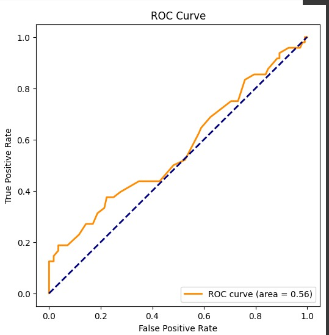
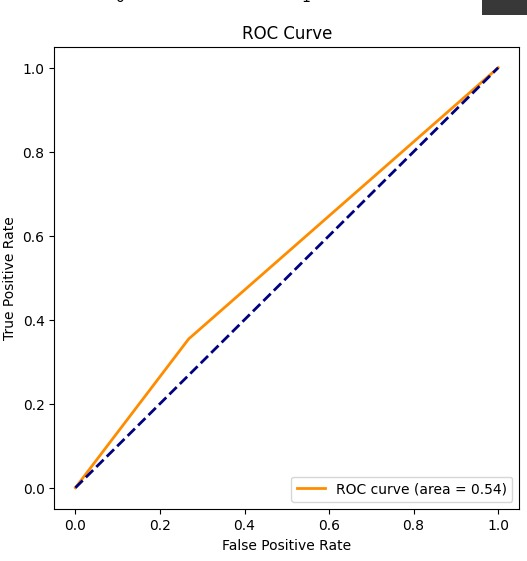
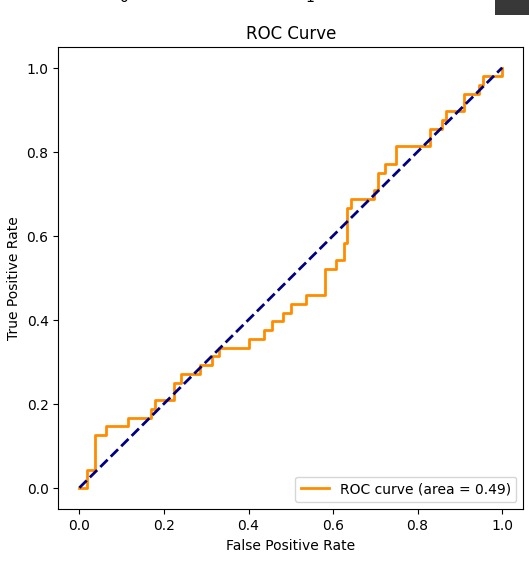
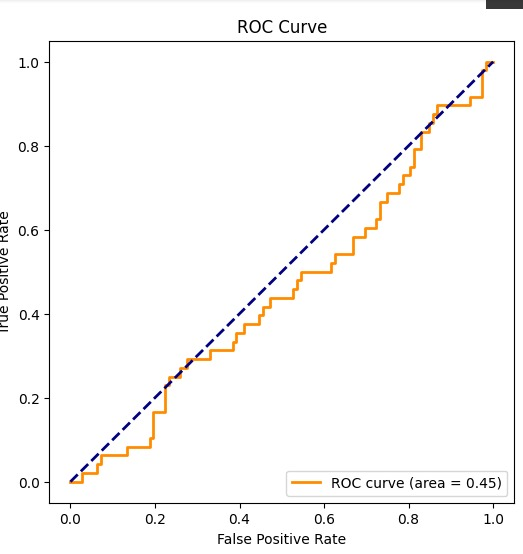

# 🚧 Traffic Road Accident Prediction Model

A Machine Learning project to predict traffic accidents using various classification algorithms.

## 📁 Dataset
- **File**: `dataset_traffic_accident_prediction1.csv`
- **Preprocessing**:
  - Missing Value Handling: Forward-fill imputation
  - Categorical Encoding: Label Encoding for all object-type features
  - Feature Selection: Mutual Information (Top 10 features for XGBoost/Decision Tree)
  - Class Balancing: SMOTE oversampling for imbalanced classes
  - Scaling: StandardScaler applied for Logistic Regression

## 🛠️ Installation
1. **Clone the repository**:
   ```bash
   git clone  https://github.com/Arka056/Road-Accident-Prediction.git
   cd traffic-accident-prediction
   pip install -r requirements.txt
   ```
2. **Install dependencies**:
   ```bash
   pip install pandas scikit-learn xgboost imbalanced-learn
   ```
## 📊 Performance Metrics
### Comprehensive Model Evaluation

<details>
<summary><b>Overall Comparison Table</b></summary>

| Model              | Accuracy | Precision | Recall | F1 Score | ROC-AUC |
|--------------------|----------|-----------|--------|----------|---------|
| Random Forest      | 73.75%   | 0.875     | 0.146  | 0.250    | 0.56    |
| Decision Tree      | 63.75%   | 0.386     | 0.354  | 0.370    | 0.54    |
| Logistic Regression| 61.88%   | 0.290     | 0.188  | 0.228    | 0.49    |
| ANN                | 66.25%   | 0.429     | 0.375  | 0.400    | 0.45    |

</details>

---

### Detailed Metrics Breakdown
<details>
<summary><b>🔵 Random Forest</b></summary>

- **Accuracy**: 73.75% (Highest among all models)  
- **Precision**: 0.875 (Excellent at minimizing false positives)  
- **Recall**: 0.146 (Severe limitation in identifying true positives)  
- **F1 Score**: 0.250 (Low due to recall-precision imbalance)  
- **ROC-AUC**: 0.56  
  

**Insight**: Best for scenarios prioritizing accuracy over minority class detection.
</details>

<details>
<summary><b>🌳 Decision Tree</b></summary>

- **Accuracy**: 63.75%  
- **Precision**: 0.386 (Moderate false positive rate)  
- **Recall**: 0.354 (Better than RF but still suboptimal)  
- **F1 Score**: 0.370 (Balanced but low overall)  
- **ROC-AUC**: 0.54  
  

**Insight**: Balanced performance but lacks specialization for imbalanced data.
</details>

<details>
<summary><b>📉 Logistic Regression</b></summary>

- **Accuracy**: 61.88%  
- **Precision**: 0.290 (High false positive rate)  
- **Recall**: 0.188 (Poorest minority class identification)  
- **F1 Score**: 0.228 (Lowest overall)  
- **ROC-AUC**: 0.49  
  

**Insight**: Struggles with non-linear patterns in imbalanced datasets.
</details>

<details>
<summary><b>🤖 ANN (Artificial Neural Network)</b></summary>

- **Accuracy**: 66.25%  
- **Precision**: 0.429 (Second-best precision)  
- **Recall**: 0.375 (Best recall among all models)  
- **F1 Score**: 0.400 (Most balanced metric)  
- **ROC-AUC**: 0.45  
  

**Insight**: Better at capturing complex relationships but computationally intensive.
</details>

---

### Critical Observations
- **Accuracy vs. Utility Tradeoff**:  
  Random Forest’s high accuracy (73.75%) masks poor recall (14.6%), making it unreliable for accident prevention systems.

- **Class Imbalance Impact**:  
  All models show recall < 40%, highlighting dataset imbalance challenges.

- **F1 Score Relevance**:  
  ANN achieves the highest F1 (0.400), suggesting better practical utility despite lower accuracy.

- **ROC-AUC Consistency**:  
  Scores range between 0.45–0.56, indicating no model excels at probabilistic separation.


<!-- CONTRIBUTING -->
### Contributing
Contributions are welcome! Please fork the repository and submit a pull request for any enhancements or bug fixes.
Don't forget to give the project a star! Thanks again!

1. Fork the Project
2. Create your Feature Branch (`git checkout -b feature/AmazingFeature`)
3. Commit your Changes (`git commit -m 'Add some AmazingFeature'`)
4. Push to the Branch (`git push origin feature/AmazingFeature`)
5. Open a Pull Request

<p align="right">(<a href="#readme-top">back to top</a>)</p>


<!-- CONTACT -->
## Contact

Arka Kundu [LinkedIn](https://www.linkedin.com/in/arka-kundu-03b2a226b/) - [Email] - arka99325@gmail.com

Project Link: [Road Accident Prediction](https://github.com/Arka056/Road-Accident-Prediction)

<p align="right">(<a href="#readme-top">back to top</a>)</p>


<!-- ACKNOWLEDGMENTS -->
## Acknowledgments
* [GitHub Pages](https://pages.github.com)
* [Font Awesome](https://fontawesome.com)
* [mdpi docs](https://www.mdpi.com/2071-1050/15/7/5939)
* [IEEE Xplore](https://ieeexplore.ieee.org/document/9972671/)
